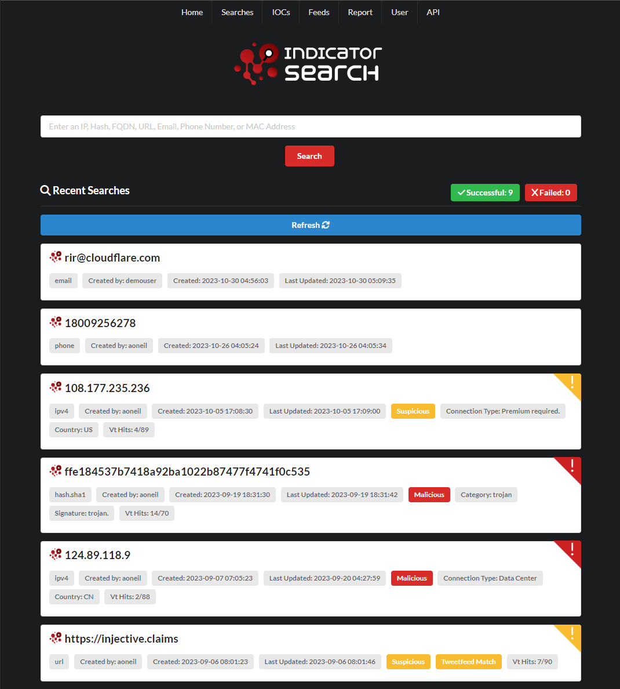
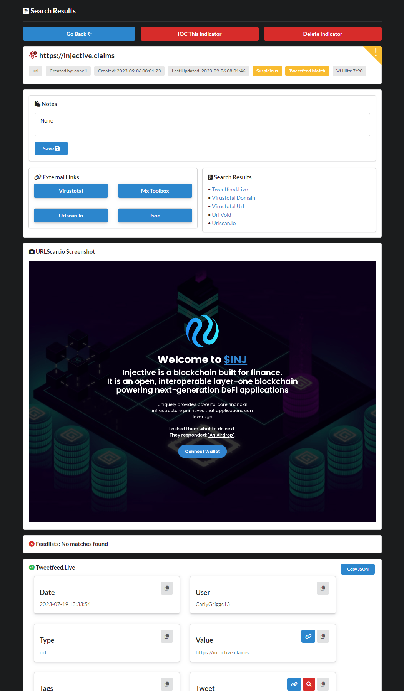

# Indicator Search


## About
Indicator Search is a web application and API designed for rapid scanning of indicators (observables found during a security incident) against multiple OSINT sites, based on the input indicator type. Inspired by Intelowl, this project aims to provide a similar tool while utilizing the FastAPI framework. Indicator search could deployed among a shared server between security engineers to aid in quick observable lookups as it enables analysts to gather information from various sources in a streamlined manner.

### Contributing
If you're interested in contributing to Indicator Search, feel free to fork this repository, make your improvements, and submit a pull request. I welcome any enhancements or bug fixes that can make this tool even more valuable for the security community.
### Disclaimer
Indicator Search is a tool designed for informational purposes and should be used responsibly and ethically. It relies on APIs and public threat feeds. Please ensure that you comply with the terms of use of the data sources accessed by this tool prior to its usage.

### Demo
Discover the app's features and capabilities through a live demonstration at [indicatorsearch.app](https://indicatorsearch.app).



## Setup
For now, Indicator Search can either be ran locally, served over port 8000 or via docker container. The instructions below should get you started.

This project runs on Fastapi (Python3), you will need:
* Python3
* Docker / Docker-compose if you want to run via docker

1. Git clone the repo and cd into it.
2. Run `python3 indicator_search.py` to install dependencies.
3. Configure `./config/.env`.
4. Run `python3 indicator_search.py` again and choose an option from the menu.

### Env File
The env file located at `./config/.env` is used to configure the applications api keys and tweakable settings. 

On inital run of the app, it will clone the `.env.example` file also located in the config folder and then print a message asking you to configure it.

* `SERVER_ADDRESS`: Used for seeding API calls and slack notifications
* `HOSTNAME`: Required for docker https proxy
* `ADMIN_API_KEY`: A user's api key for the ageout ioc automation that is ran every hour
* `USER_INVITE_KEY`: Required for user signup
* `ENABLE_SLACK`: True/False
* `SLACK_BOT_TOKEN`: Slack bot token with message permissions
* `SLACK_CHANNEL`: Channel to post slack updates to

### Tool API Keys
If you don't have an api key, leave the value as `"API_KEY": ""`

The tool will be omitted from the indicators results.

### Docker
Menu `option 2` will create a self-signed https cert and build the docker container / traefik reverse proxy.

Once the app has been built, the docker containers should always restart but if you need to start or stop the app, you can use:
* Menu `option 2a` Docker compose up
* Menu `option 2b` Docker compose down

Re-running `option 2` will rebuild your containers but the database volume is persistant between rebuilds.


Menu `option 5` will just build the docker container and tag the image as `indicator-search:latest`.
Afterwards you can run the container with the following command:

`docker run -p 8000:8000 -v "./path/to/db.sqlite:/code/db.sqlite" indicator-search:latest`

### Local instances
Menu `option 3` runs uvicorn directly and the app is reachable at `http://127.0.0.1:8000`

Menu `option 4` also runs uvicorn directly but the app is listening on all interfaces at `http://0.0.0.0:80`


## Seeding
### Seeding Feedlists
Menu `option 7` uses the json files located in `config/feedlist_examples` to auto-create new feeds. When you choose to seed the feedlists, it will iterate through all feeds in the files. If the URL is already added, the server will reject the feedlist addition.
1. Run `python3 indicator_search.py` and choose the option to seed feedlists.
2. Enter your `api_key`.

### Seeding Indicators
Menu `option 8` provides 8 example indicators to quickly test that all the API tools are working as expected.
1. Run `python3 indicator_search.py` and choose the option to seed indicators.
2. Enter your `api_key`.

### Creating A User
Menu `option 9` will use the `USER_INVITE_KEY` from the config file to create a new user.
1. Run `python3 indicator_search.py` and choose the option to create a user.
2. Enter username and password. It will use the user invite code from the config to verify user creation is expected.

## Supported Indicators
* IPv4
* IPv6
* Hash.MD5
* Hash.SHA1
* Hash.SHA256
* Hash.SHA512
* FQDN
* URL
* Email
* Phone Number
* User Agent
* MAC Address

## Tools
| Tool | Indicator Type | API Key Required? |
|------|----------------|-------------------|
|Public Feedlists|IP, Hash, FQDN|No, publicly available feedlists|
|Virus Total|IPv4, IPv6, Hash, FQDN, URL|Yes|
|Inquest Labs|IPv4, IPv6, Hash, FQDN, URL, Email|No|
|Tweetfeed|IPv4, Hash, FQDN, URL|No|
|Maltiverse|IPv4, Hash, FQDN, URL|Yes|
|Stop Forum Spam|IPv4, IPv6, Email|No|
|IPInfoio|IPv4, IPv6|No|
|Abuse IPDB|IPv4, IPv6|Yes|
|IP Quality Score|IPv4, IPv6, Phone|Yes|
|Greynoise Community|IPv4|Yes|
|Project Honeypot|IPv4|Yes|
|Hacked IP Threatlist|IPv4|No|
|Shodan|IPv4|Yes|
|URLVoid (APIVoid)|URL, FQDN, Email|Yes|
|Checkphish|URL, FQDN|Yes|
|URLScan|URL, FQDN|No|
|Breach Directory|Email|Yes|
|Kickbox Disposable|Email|No|
|Circl lu|Hash|No|
|Echo Trail|Hash|Yes|
|Hybrid Analysis|Hash|Yes|
|Malware Bazzar|Hash|No|
|Numverify|Phone|Yes|
|Whats My Browser|User Agent|Yes|
|MAC Vendors|MAC Address|No|

## Screenshots

---
### App CLI Menu 

---
### Slack Notifications


## Results JSON example
```
{
  "time_created": "2023-09-06T17:  "time_created": "2023-08-18T06:36:54",
  "username": null,
  "indicator_type": "hash.md5",
  "feedlist_results": null,
  "tags": {
    "Signature": "trojan.mimikatz/hacktoolx",
    "Category": "trojan",
    "VT Hits": "59/71",
    "Malicious": true
  },
  "enrichments": null,
  "ioc_id": null,
  "id": 16,
  "time_updated": "2023-08-18T06:37:03",
  "indicator": "a3cb3b02a683275f7e0a0f8a9a5c9e07",
  "results": [
    {
      "site": "Circl.lu",
      "results": {
        "Error": "No results found"
      }
    },
    {
      "site": "Echo Trail",
      "results": {
        "Error": "No results found"
      }
    },
    {
      "site": "Tweetfeed.live",
      "results": {
        "Error": "No results found"
      }
    },
    {
      "site": "virustotal_hash",
      "results": {
        "Harmless": 0,
        "Malicious": 59,
        "Suspicious": 0,
        "Undetected": 12,
        "Suggested Threat Label": "trojan.mimikatz/hacktoolx",
        "Popular Threat Category": "trojan",
        "Community Votes": {
          "harmless": 1,
          "malicious": 8
        },
        "Name": null,
        "Names": [
          "mimikatz-2-2.exe",
          "mimimikotiki.exe",
          "mimikatz",
          "mimikatz.exe",
          "kittenz.exe",
          "mimimikotiki.ex_",
          "Cobaltbghdbghich21_browsingExe.exe",
          "mim64.exe",
          "flag5{c5237169a63c259944d3b8fe59db0ab8}.exe",
          "mimikatz.pdf",
          "._cache__CACHE~2.EXE",
          "output.213384677.txt",
          "mimik.exe",
          "itrackBr_6da58a5f-2b81-452c-b5eb-7f28a21d33d3.jpg",
          "31eb1de7e840a342fd468e558e5ab627bcb4c542a8fe01aec4d5ba01d539a0fc.exe",
          "output.193444480.txt",
          "go-memexec-706618059.exe",
          "._cache__CACHE~1.EXE",
          "_CACHE~2.EXE",
          "ben4585.tmp.exe",
          "_CACHE~1.EXE",
          "._cache_file.exe",
          "google.exe",
          "._cache_a6f78e8bef7166b336de0dc89103124b503bb59689f7d407b4436c8b689fca5f.exe"
        ],
        "Type": "PE32+ executable (console) x86-64, for MS Windows",
        "Type Tag": "peexe",
        "Tags": [
          "peexe",
          "assembly",
          "overlay",
          "runtime-modules",
          "signed",
          "detect-debug-environment",
          "idle",
          "long-sleeps",
          "direct-cpu-clock-access",
          "64bits",
          "checks-disk-space"
        ],
        "Times Submitted": 65,
        "Product": "mimikatz",
        "Product Description": "mimikatz for Windows",
        "Signed": "Signed",
        "Signing Date": "05:19 PM 09/18/2020",
        "MD5": "a3cb3b02a683275f7e0a0f8a9a5c9e07",
        "SHA1": "d241df7b9d2ec0b8194751cd5ce153e27cc40fa4",
        "SHA256": "31eb1de7e840a342fd468e558e5ab627bcb4c542a8fe01aec4d5ba01d539a0fc"
      }
    },
    {
      "site": "Hybrid Analysis",
      "results": {
        "File Name": "mimkatz",
        "Type": "PE32+ executable (console) x86-64, for MS Windows",
        "Job Environment": "Windows 10 64 bit",
        "AV Detect": 78,
        "VX Family": "HackTool.Mimikatz",
        "Verdict": "malicious",
        "Threat Score": 100,
        "SHA1": "d241df7b9d2ec0b8194751cd5ce153e27cc40fa4",
        "SHA256": "31eb1de7e840a342fd468e558e5ab627bcb4c542a8fe01aec4d5ba01d539a0fc",
        "SHA512": "95a99fd1686bd5b01d3eb5b055d3cab900e6480d4e2360595b64d57c80e74daa4c14753fa2e0e224ea5c72735af3339fb72f7d9455f4feeb3e237e6c20866d96",
        "Classification": [
          "banker",
          "emotet",
          "hacktool",
          "infostealer",
          "netwire",
          "qakbot",
          "ransomware",
          "rat"
        ],
        "Tags": [
          "tag",
          "banker",
          "emotet",
          "hacktool",
          "infostealer",
          "netwire",
          "qakbot",
          "ransomware",
          "rat"
        ]
      }
    },
    {
      "site": "Malware Bazzar",
      "results": {
        "File Type": "exe",
        "Signature": "MimiKatz",
        "File Name": "31eb1de7e840a342fd468e558e5ab627bcb4c542a8fe01aec4d5ba01d539a0fc",
        "Delivery Method": null,
        "Tags": null
      }
    },
    {
      "site": "InQuestLabs",
      "results": {
        "Error": "No results found"
      }
    }
  ],
  "external_links": {
    "VirusTotal": "https://www.virustotal.com/gui/file/a3cb3b02a683275f7e0a0f8a9a5c9e07",
    "Hybrid Analysis": "https://www.hybrid-analysis.com/search?query=a3cb3b02a683275f7e0a0f8a9a5c9e07",
    "Joes Sandbox": "https://www.joesandbox.com/search?q=a3cb3b02a683275f7e0a0f8a9a5c9e07",
    "JSON": "http://127.0.0.1:8000/api/indicator/16"
  },
  "notes": null,
  "complete": true
}04:29",
  "username": "aoneil",
  "indicator_type": "hash.md5",
  "feedlist_results": null,
  "tags": {
    "signature": "trojan.mimikatz/hacktoolx",
    "category": "trojan",
    "vt_hits": "53/65",
    "malicious": true
  },
  "enrichments": null,
  "ioc_id": null,
  "time_updated": "2023-09-06T17:04:38",
  "id": 9,
  "indicator": "a3cb3b02a683275f7e0a0f8a9a5c9e07",
  "results": [
    {
      "site": "circl.lu",
      "results": {
        "error": "No results found"
      }
    },
    {
      "site": "echo_trail",
      "results": {
        "error": "No results found"
      }
    },
    {
      "site": "tweetfeed.live",
      "results": {
        "error": "No results found"
      }
    },
    {
      "site": "virustotal_hash",
      "results": {
        "malicious": 53,
        "undetected": 12,
        "suggested_threat_label": "trojan.mimikatz/hacktoolx",
        "popular_threat_category": "trojan",
        "community_votes": {
          "harmless": 1,
          "malicious": 8
        },
        "names": [
          "output.256963751.txt",
          "mimikatz",
          "mimikatz.exe",
          "output.256962353.txt",
          "mimikatz-2-2.exe",
          "mimimikotiki.exe",
          "kittenz.exe",
          "mimimikotiki.ex_",
          "Cobaltbghdbghich21_browsingExe.exe",
          "mim64.exe",
          "flag5{c5237169a63c259944d3b8fe59db0ab8}.exe",
          "mimikatz.pdf",
          "._cache__CACHE~2.EXE",
          "output.213384677.txt",
          "mimik.exe",
          "itrackBr_6da58a5f-2b81-452c-b5eb-7f28a21d33d3.jpg",
          "31eb1de7e840a342fd468e558e5ab627bcb4c542a8fe01aec4d5ba01d539a0fc.exe",
          "output.193444480.txt",
          "go-memexec-706618059.exe",
          "._cache__CACHE~1.EXE",
          "_CACHE~2.EXE",
          "ben4585.tmp.exe",
          "_CACHE~1.EXE",
          "._cache_file.exe",
          "google.exe"
        ],
        "type": "PE32+ executable (console) x86-64, for MS Windows",
        "type_tag": "peexe",
        "tags": [
          "peexe",
          "assembly",
          "overlay",
          "runtime-modules",
          "signed",
          "detect-debug-environment",
          "idle",
          "long-sleeps",
          "direct-cpu-clock-access",
          "64bits",
          "checks-disk-space"
        ],
        "times_submitted": 67,
        "product": "mimikatz",
        "product_description": "mimikatz for Windows",
        "signed": "Signed",
        "signing_date": "05:19 PM 09/18/2020",
        "md5": "a3cb3b02a683275f7e0a0f8a9a5c9e07",
        "sha1": "d241df7b9d2ec0b8194751cd5ce153e27cc40fa4",
        "sha256": "31eb1de7e840a342fd468e558e5ab627bcb4c542a8fe01aec4d5ba01d539a0fc"
      }
    },
    {
      "site": "hybrid_analysis",
      "results": {
        "file_name": "mimkatz",
        "type": "PE32+ executable (console) x86-64, for MS Windows",
        "job_environment": "Windows 10 64 bit",
        "av_detect": 78,
        "vx_family": "HackTool.Mimikatz",
        "verdict": "malicious",
        "threat_score": 100,
        "sha1": "d241df7b9d2ec0b8194751cd5ce153e27cc40fa4",
        "sha256": "31eb1de7e840a342fd468e558e5ab627bcb4c542a8fe01aec4d5ba01d539a0fc",
        "sha512": "95a99fd1686bd5b01d3eb5b055d3cab900e6480d4e2360595b64d57c80e74daa4c14753fa2e0e224ea5c72735af3339fb72f7d9455f4feeb3e237e6c20866d96",
        "classification": [
          "banker",
          "emotet",
          "hacktool",
          "infostealer",
          "netwire",
          "qakbot",
          "ransomware",
          "rat"
        ],
        "tags": [
          "tag",
          "banker",
          "emotet",
          "hacktool",
          "infostealer",
          "netwire",
          "qakbot",
          "ransomware",
          "rat"
        ]
      }
    },
    {
      "site": "malware_bazzar",
      "results": {
        "file_type": "exe",
        "signature": "MimiKatz",
        "file_name": "31eb1de7e840a342fd468e558e5ab627bcb4c542a8fe01aec4d5ba01d539a0fc"
      }
    },
    {
      "site": "inquest_labs",
      "results": {
        "error": "No results found"
      }
    },
    {
      "site": "maltiverse",
      "results": {
        "classification": "malicious",
        "blacklist": [
          {
            "count": 1,
            "description": "Common Raven",
            "first_seen": "2023-02-05 04:18:59",
            "labels": [
              "malicious-activity"
            ],
            "last_seen": "2023-02-06 02:06:31",
            "source": "Maltiverse"
          },
          {
            "count": 1,
            "description": "Generic Malware",
            "first_seen": "2023-01-31 07:45:03",
            "last_seen": "2023-01-31 07:45:03",
            "source": "Hybrid-Analysis"
          },
          {
            "count": 1,
            "description": "MimiKatz",
            "first_seen": "2022-06-21 10:53:09",
            "labels": [
              "malicious-activity"
            ],
            "last_seen": "2022-06-21 10:53:09",
            "source": "MalwareBazaar Abuse.ch"
          },
          {
            "count": 1,
            "description": "Gen:Heur.Mimikatz",
            "first_seen": "2020-09-23 08:16:05",
            "last_seen": "2020-09-23 08:16:05",
            "source": "Hybrid-Analysis"
          }
        ],
        "tags": [
          "apt",
          "banker",
          "emotet",
          "hacktool",
          "infostealer",
          "netwire",
          "qakbot",
          "ransomware",
          "rat"
        ]
      }
    }
  ],
  "external_links": {
    "virustotal": "https://www.virustotal.com/gui/file/a3cb3b02a683275f7e0a0f8a9a5c9e07",
    "hybrid_analysis": "https://www.hybrid-analysis.com/search?query=a3cb3b02a683275f7e0a0f8a9a5c9e07",
    "joes_sandbox": "https://www.joesandbox.com/search?q=a3cb3b02a683275f7e0a0f8a9a5c9e07",
    "json": "https://indicatorsearch.app/api/indicator/9"
  },
  "notes": null,
  "complete": true
}
```