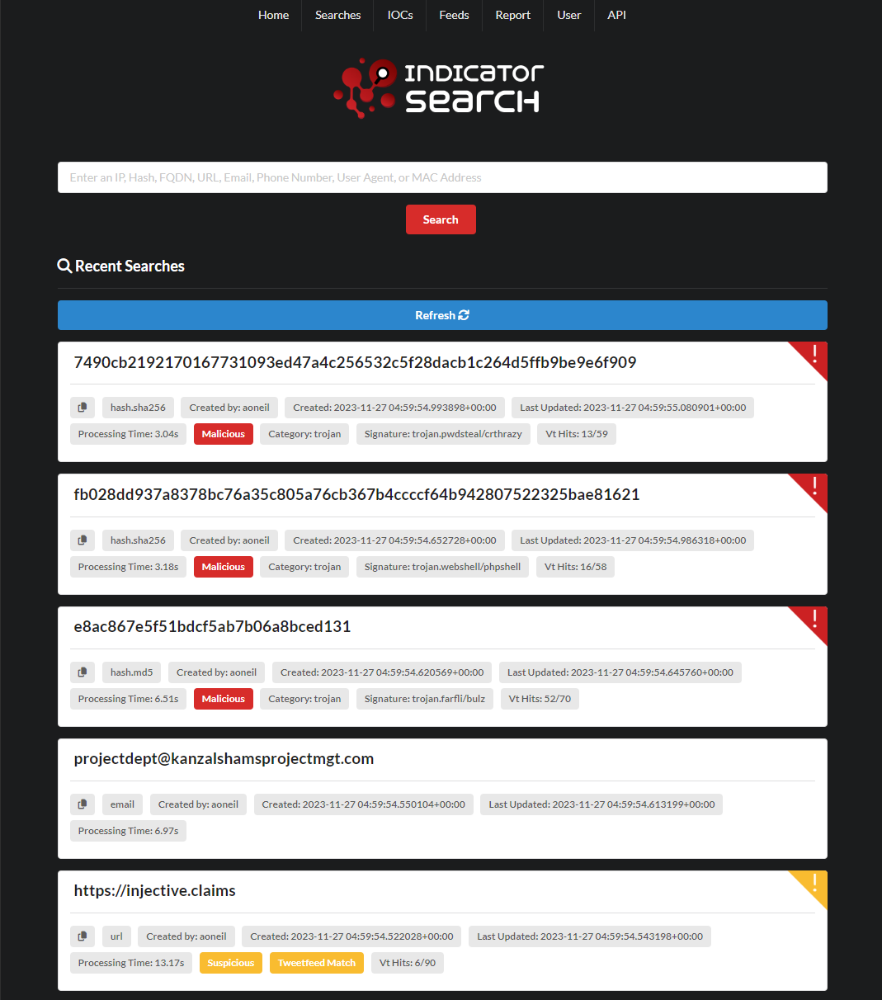

# Indicator Search


## About
Indicator Search is a web application and API designed for rapid aggregation of OSINT results, based on the input indicator type. Inspired by Intelowl, this project aims to provide a similar tool while utilizing the FastAPI framework. 

### Contributing
If you're interested in contributing to Indicator Search, feel free to fork this repository, make your improvements, and submit a pull request. I welcome any enhancements or bug fixes that can make this tool even more valuable for the security community.
### Disclaimer
Indicator Search is a tool designed for informational purposes and should be used responsibly and ethically. It relies on APIs and public threat feeds. Please ensure that you comply with the terms of use of the data sources accessed by this tool prior to its usage.



## Supported Indicators
* IPv4
* IPv6
* Hash.MD5
* Hash.SHA1
* Hash.SHA256
* Hash.SHA512
* FQDN
* URL
* Email
* Phone Number
* User Agent
* MAC Address

## Tools
| Tool | Indicator Type | API Key Required? | Link |
|------|----------------|-------------------|------|
|Public Feedlists|IP, Hash, FQDN, Any|No, publicly available feedlists||
|Virus Total|IPv4, IPv6, Hash, FQDN, URL|Yes|[link](https://virustotal.com)|
|Tweetfeed|IPv4, Hash, FQDN, URL|No|[link](https://tweetfeed.live/)|
|Maltiverse|IPv4, Hash, FQDN, URL|Yes|[link](https://whatis.maltiverse.com/)|
|Stop Forum Spam|IPv4, IPv6, Email|No|[link](https://www.stopforumspam.com/)|
|IPInfoio|IPv4, IPv6|No|[link](https://ipinfo.io/)|
|Abuse IPDB|IPv4, IPv6|Yes|[link](https://www.abuseipdb.com/)|
|IP Quality Score|IPv4, IPv6, Phone|Yes|[link](https://www.ipqualityscore.com/)|
|Greynoise Community|IPv4|Yes|[link](https://www.greynoise.io/)|
|Greynoise Enterprise|IPv4|Yes|[link](https://www.greynoise.io/)|
|Project Honeypot|IPv4|Yes|[link](https://www.projecthoneypot.org/)|
|Hacked IP Threatlist|IPv4|No|[link](http://www.hackedip.com/)|
|Shodan|IPv4|Yes|[link](https://www.shodan.io/)|
|URLVoid (APIVoid)|URL, FQDN, Email|Yes|[link](https://www.urlvoid.com/)|
|URLScan|URL, FQDN|No|[link](https://urlscan.io/)|
|Breach Directory|Email|Yes|[link](https://breachdirectory.org/)|
|Kickbox Disposable|Email|No|[link](https://open.kickbox.io/)|
|Circl lu|Hash|No|[link](https://www.circl.lu/)|
|Echo Trail|Hash|Yes|[link](https://www.echotrail.io/)|
|Hybrid Analysis|Hash|Yes|[link](https://www.hybrid-analysis.com/)|
|Malware Bazzar|Hash|No|[link](https://bazaar.abuse.ch/)|
|Numverify|Phone|Yes|[link](https://numverify.com/)|
|Whats My Browser|User Agent|Yes|[link](https://www.whatsmybrowser.org/)|
|MAC Vendors|MAC Address|No|[link](https://macvendors.com/)|

## Setup / How to use
See the [Indicator Search setup guide](./setup.md).

## Example Results


```
{
  "time_created": "2023-12-09T15:34:33.616428",
  "time_updated": "2023-12-09T15:34:33.627550",
  "username": "aoneil",
  "indicator_type": "url",
  "feedlist_results": [],
  "tags": {
    "tweetfeed_match": true,
    "vt_hits": "6/90",
    "suspicious": true
  },
  "enrichments": {
    "last_scan_screenshot": "https://urlscan.io/screenshots/7e27ee56-5caa-4227-841a-1121cf65b692.png"
  },
  "complete": true,
  "id": 25,
  "processing_time": 26.55,
  "indicator": "https://injective.claims",
  "results": [
    {
      "tool": "tweetfeed.live",
      "outcome": {
        "status": "results_found",
        "error_message": null,
        "status_code": 200,
        "reason": "OK"
      },
      "results": {
        "date": "2023-07-19 13:33:54",
        "user": "CarlyGriggs13",
        "type": "url",
        "value": "https://injective.claims",
        "tags": [
          "#phishing",
          "#scam",
          "#malware"
        ],
        "tweet": "https://twitter.com/CarlyGriggs13/status/1681658624647602176"
      }
    },
    {
      "tool": "urlscan.io",
      "outcome": {
        "status": "results_found",
        "error_message": null,
        "status_code": 200,
        "reason": "OK"
      },
      "results": {
        "last_scan_guid": "7e27ee56-5caa-4227-841a-1121cf65b692",
        "last_scan_url": "https://urlscan.io/result/7e27ee56-5caa-4227-841a-1121cf65b692/",
        "last_scan_time": "2023-07-20T07:15:35.447Z",
        "last_scan_score": 0,
        "categories": [],
        "malicious": false,
        "tags": [],
        "last_scan_screenshot": "https://urlscan.io/screenshots/7e27ee56-5caa-4227-841a-1121cf65b692.png"
      }
    },
    {
      "tool": "virustotal_domain",
      "outcome": {
        "status": "results_found",
        "error_message": null,
        "status_code": 200,
        "reason": "OK"
      },
      "results": {
        "whois": null,
        "creation_date": "",
        "whois_date": "",
        "harmless": 60,
        "malicious": 5,
        "suspicious": 1,
        "undetected": 22,
        "categories": {
          "Webroot": "Phishing and Other Frauds",
          "Xcitium Verdict Cloud": "media sharing",
          "Sophos": "spyware and malware",
          "alphaMountain.ai": "Suspicious (alphaMountain.ai)"
        },
        "tld": "claims",
        "tags": [],
        "community_votes": {
          "harmless": 0,
          "malicious": 0
        },
        "last_analysis": "Mon Oct 30 17:29:02 2023"
      }
    },
    {
      "tool": "virustotal_url",
      "outcome": {
        "status": "results_found",
        "error_message": null,
        "status_code": 200,
        "reason": "OK"
      },
      "results": {
        "harmless": 63,
        "malicious": 6,
        "suspicious": 1,
        "undetected": 20,
        "url": "https://injective.claims/",
        "final_url": null,
        "last_response_code": 200,
        "redirection_chain": null,
        "tld": "claims",
        "threat_names": [
          "Mal/HTMLGen-A"
        ],
        "tags": [],
        "community_votes": {
          "harmless": 0,
          "malicious": 0
        },
        "categories": {
          "Webroot": "Phishing and Other Frauds",
          "Sophos": "spyware and malware",
          "Xcitium Verdict Cloud": "media sharing",
          "alphaMountain.ai": "Suspicious (alphaMountain.ai)"
        }
      }
    },
    {
      "tool": "shimon",
      "outcome": {
        "status": "no_results_found",
        "error_message": null,
        "status_code": null,
        "reason": null
      },
      "results": {}
    },
    {
      "tool": "url_void",
      "outcome": {
        "status": "no_results_found",
        "error_message": null,
        "status_code": null,
        "reason": null
      },
      "results": {}
    },
    {
      "tool": "wayback_machine",
      "outcome": {
        "status": "no_results_found",
        "error_message": null,
        "status_code": null,
        "reason": null
      },
      "results": {}
    }
  ],
  "external_links": {
    "virustotal": "https://www.virustotal.com/gui/domain/https://injective.claims",
    "mx_toolbox": "https://mxtoolbotwitter/SuperTool.aspx?action=mx%3ahttps://injective.claims&run=toolpage",
    "urlscan.io": "https://urlscan.io/search/#injective.claims",
    "google": "https://www.google.com/search?q=https://injective.claims",
    "twitter": "https://twitter.com/search?q=https://injective.claims&src=typed_query",
    "json": "https://indicatorsearch.app/api/indicator/25"
  },
  "notes": null,
  "summary": "The analysis from the data collected from multiple tools reveals significant findings. Tweetfeed.live has identified a potentially malicious URL posted by the user 'CarlyGriggs13', which was tagged as #phishing, #scam, and #malware. Further investigation into this URL was conducted, with Urlscan.io recording no indication of malicious activity. It provided a screenshot of the page visited via this URL link for reference. However contrary findings were noted from the Virustotal domain and Virustotal URL tools which both showed results suggesting this could be a potentially harmful URL. They flagged the URL as 'Spyware and Malware', 'Phishing and Other Frauds', 'Media sharing' and as 'Suspicious' by alphaMountain.ai respectively. Still, it's worth mentioning that the majority of antivirus solutions used by Virustotal domain and Virustotal URL did not detect any issues. The exact threat identified was 'Mal/HTMLGen-A', yet community votes found no consensus on the URL being either harmful or harmless. The contradiction in the data calls for additional analysis and scrutiny of the identified URL. Furthermore, no specific details regarding the creation date or whois date were provided.",
  "ioc_id": null
}
```
