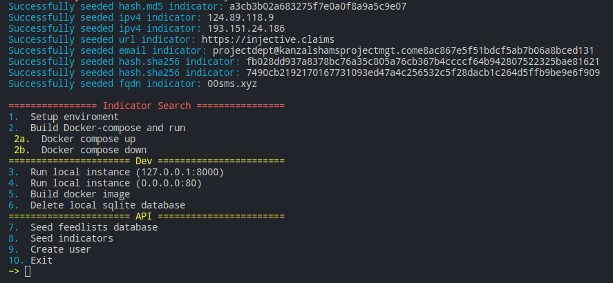

# Menu
[Setup Indicator Search](setup.md) | [Go back to readme](../README.md)

## Run Indicator Search
Menu `option 2` will create a self-signed https cert, build the docker container, setup postgres and a traefik reverse proxy.

Once the app has been built, the docker containers should always restart on reboot of the host but if you need to start or stop the app, you can use:
* Menu `option 2a` Docker compose up
* Menu `option 2b` Docker compose down

Re-running `option 2` will rebuild your containers (the database volume is persistant between rebuilds).

## Development
Menu `option 3` or (-d) runs a local reloadable version of the app and is reachable at `http://127.0.0.1:8000`

Menu `option 4` will 

Menu `option 5` will just build a docker container, prompt for a tag and a repository to upload to. This option will allow you to run your indicator search app somewhere other than the current host you're configuring it from. Make sure all of the settings in the configuration file are correct for where you plan to be running the app.

## Seeding Feedlists
Menu `option 6` uses the json files located in `config/feedlist_examples` to auto-create new feeds. When you choose to seed the feedlists, it will iterate through all feeds in the files. If the URL is already added, the server will reject the feedlist addition.

## Seeding Indicators
Menu `option 7` provides 8 example indicators to quickly test that all the API tools are working as expected.

## Creating A User
Menu `option 8` will use the `USER_INVITE_KEY` from the config file to create a new user.

Menu `option 9` will use the `USER_INVITE_KEY` from the config file to create a new "Admin" user. Once completed, it will display an API key for the Admin user. Save this API key to the .env file to enable the IOC ageout automation that runs hourly to prune expired IOCs.