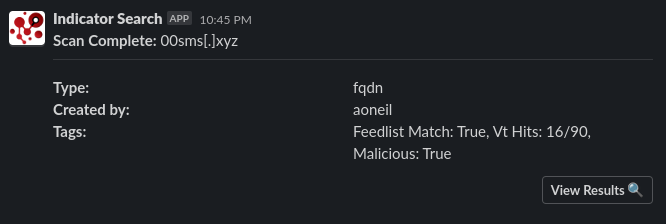

# Setup
[Indicator Search menu](menu.md) | [Go back to readme](../README.md)

This project operates on FastAPI with Python 3.10.

Necessary OS packages include:
- Python 3.10
- Docker and Docker-compose

Follow these steps:

1. Clone the repository and navigate to it.
2. Execute `python3 indicator_search.py`. This will duplicate the example environment file and prompt you to complete it.
3. Adjust the settings in the `./config/.env` file.
4. Re-run `python3 indicator_search.py` to set up the environment and access the Indicator Search menu.
5. Choose your preferred method for running Indicator Search from the menu.
6. Create an admin user and save the API to the .env file for the api menu options to work. This API key is also used for the IOC ageout automation that runs every hour.

## Env File
The env file located at `./config/.env` is used to configure the applications api keys and tweakable settings. 

On inital run of the app, it will clone the `.env.example` file also located in the config folder and then print a message asking you to configure it.

* `SERVER_ADDRESS`: Used for seeding API calls, slack notifications, and result links.
* `HOSTNAME`: Required for docker https proxy, this must be the same as the hostname on the SSL cert. 
* `ADMIN_API_KEY`: A user's api key for the ageout ioc automation that is ran every hour.
* `USER_INVITE_KEY`: Required for user signup.
* `ENABLE_SLACK`: True/False
* `SLACK_BOT_TOKEN`: Slack bot token with message permissions.
* `SLACK_CHANNEL`: Channel to post slack updates to.
* `DOCKER_IMAGE_TAG`: indicator_search:latest
* `DOCKER_REGISTRY`: Dockerregistry.com/user/repo
* `POSTGRES_HOST`: If running on the same host, this is handled for you. If you want to build an image and push to a container, make sure to set the correct postgres IP.
* `POSTGRES_USER`: User for postgres.
* `POSTGRES_PASSWORD`: Password for the postgres user.
* `POSTGRES_DB`: Database name for Indicator Search data.

## Tool API Keys
If you don't have an api key, leave the value as `"API_KEY": ""`

The tool will be omitted from the indicators results.

## Slack Notifications
